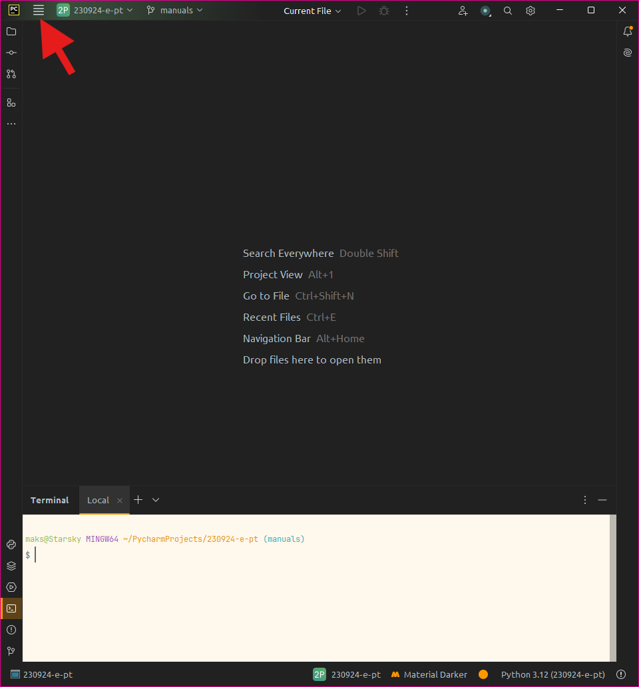
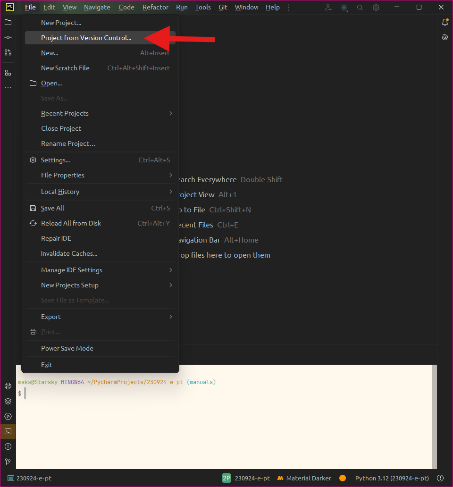
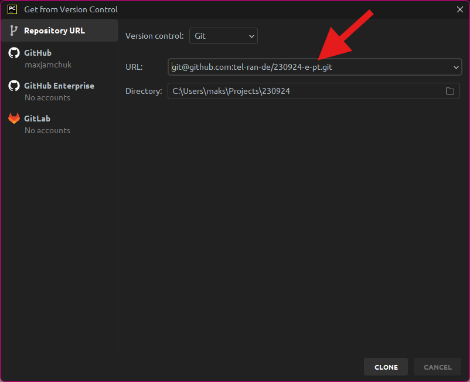
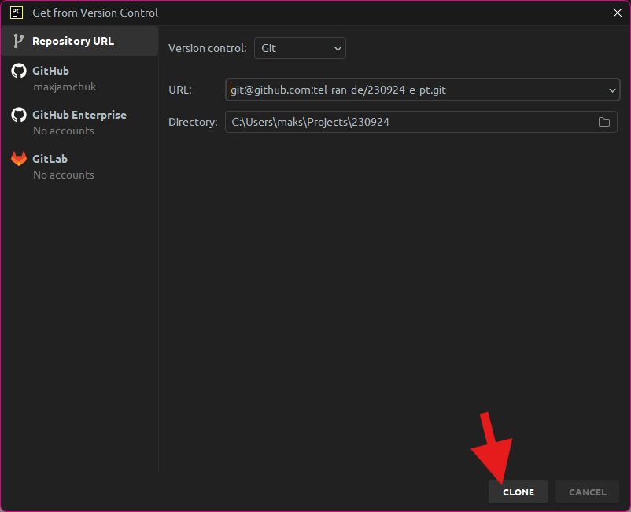
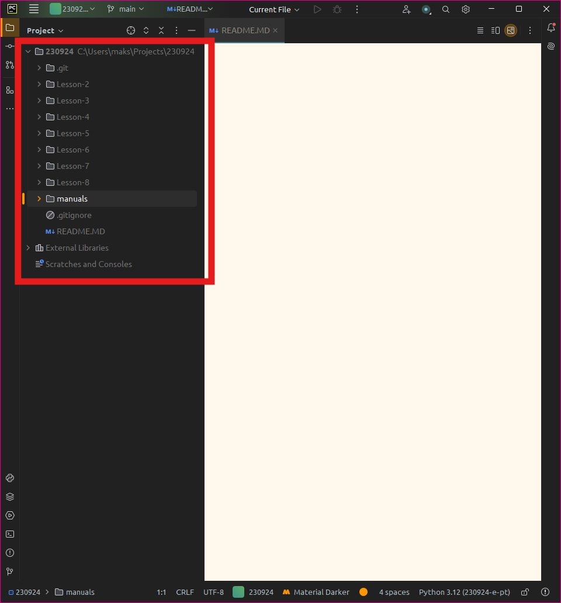
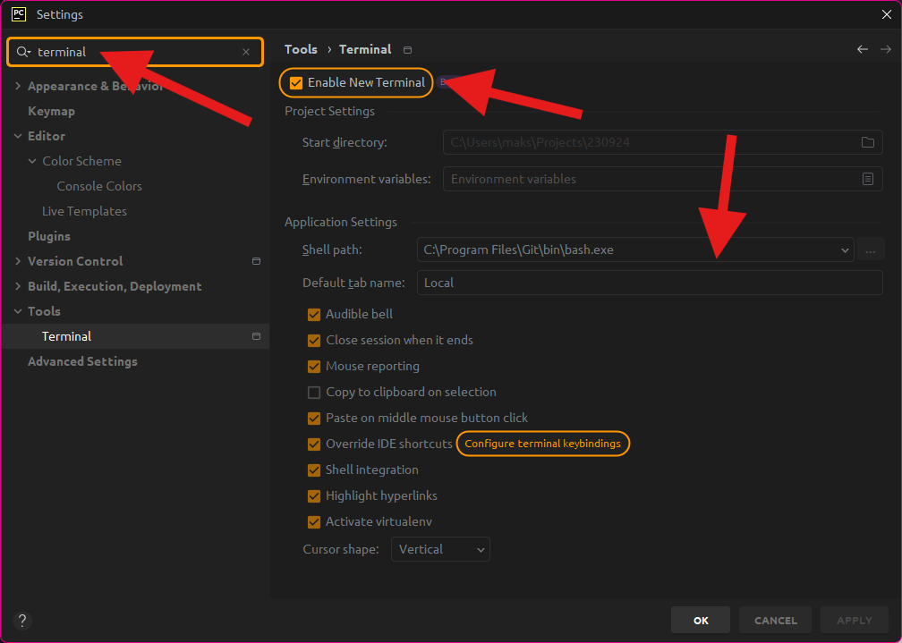
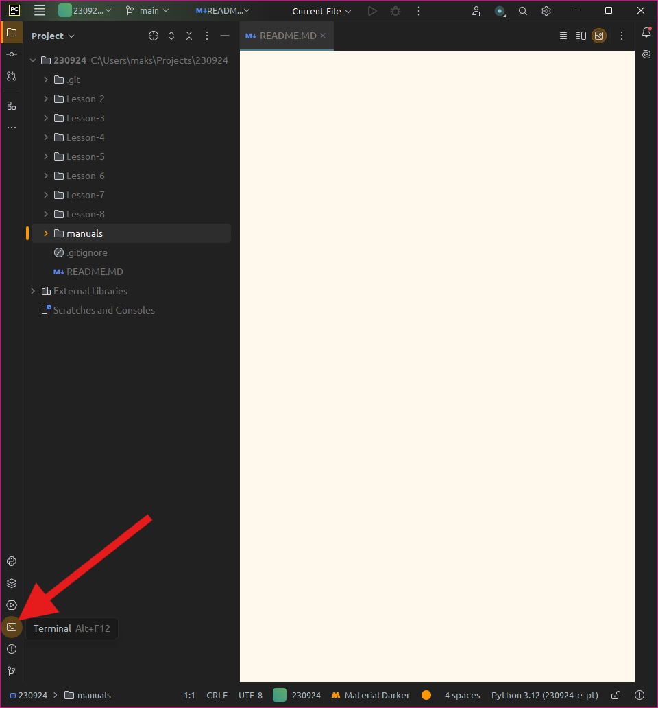
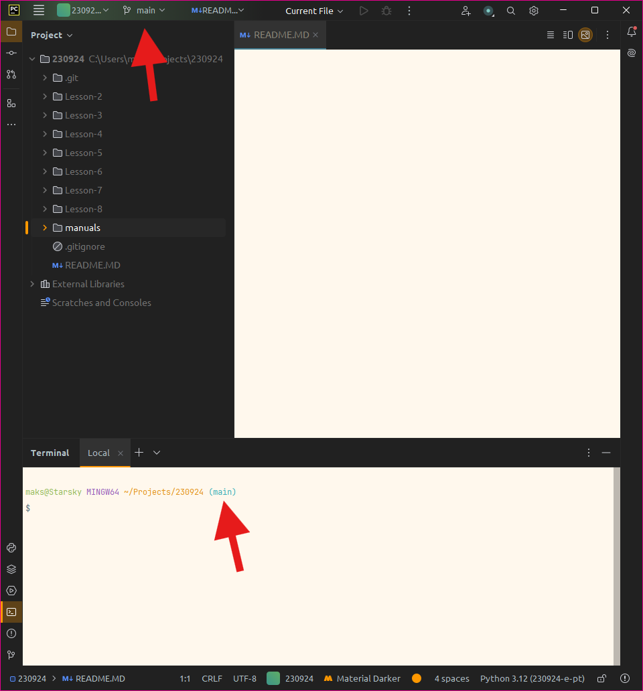
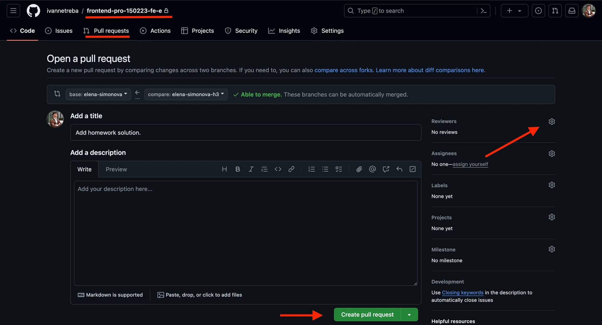

## Настройка для работы студента

### Шаг 1.
Для начала работы на курсе склонируйте репозиторий на локальные компьютеры через команду
```bash
git clone git@github.com:tel-ran-de/230924-e-pt.git
```
После чего открыть папку проекта в **PyCharm**.

Либо сразу клонировать проект через **PyCharm**




Некоторое время (не больше пяти минут) PyCharm будет создавать виртуальное окружение

Если увидите похожую картину (папки с уроками), значит вы всё сделали правильно.


***
### Шаг 2.
Поставьте консоль по умолчанию **bash** в **PyCharm**
1. Зайдите в настройки, через меню-гамбугер или через сочетание клавиш **Ctrl+Alt+S**
2. Наберите в поиске **terminal**
3. Поставьте галочку **Enable New Terminal**, если она не поставлена
4. Выберите **Shell path** до вашего **Git Bash**, с высокой степенью вероятности, у вас окажется такой же путь.


***
### Шаг 3.
Терминал открывается сочетанием клавиш **Alt+F12**, либо по кнопке как на скриншоте:


В терминале, либо в верхнем меню вы можете видеть ветку в которой вы находитесь сейчас.


***
### Шаг 4.
Создайте свои именованные ветки с использованием имени и фамилии, например, `sergey-ivanov`, `anna-petrova`.
Именная ветка должна быть создана **ОТ ВЕТКИ** `main`.
Не забудьте обновить ветку `main` перед созданием личной ветки с помощью команды:
```bash
git pull origin main
```
Для создания ветки и переключения на неё используйте команду
```bash
git checkout -b <название ветки>
```

***
### Шаг 5.
Отправьте свои ветки на удаленный репозиторий через команду 
```bash 
git push origin <название ветки>`
```

Команда 
```bash
git branch
```
покажет, какие ветки уже существуют в локальном репозитории.

Чтобы увидеть ветки на удалённом репозитории, введите 
```bash
git branch -r
```
Посмотреть все ветки (и локальные, и на удалённом репозитории) можно через 
```bash
git branch -a
```
***
### Шаг 6.

***
***
## Работа на уроке и сдача домашнего задания

### Шаг 1.
Чтобы увидеть добавленный в удаленную ветку `main` код или домашнее задание, необходимо обновить локальную ветку `main`.
Для этого переключитесь на главную ветку через `git checkout main` и запросите обновления с удаленного репозитория через `git pull origin main`.

***
### Шаг 2.
В саму ветку main ничего отправлять не нужно! Она нужна для просмотра кода, материалов, заданий от преподавателя.

***
### Шаг 3.
Для выполнения практических заданий на уроке или домашних заданий студенту нужно перейти в СВОЮ именованную ветку `git checkout <имя ветки>` и от НЕЁ создать ветку для работы на уроке или выполнения домашнего задания `git checkout -b <название ветки>`.

Чтобы не путаться в названиях веток лучше придерживаться такого нейминга: в начале указывать имя и фамилию, а потом номер урока или домашнего задания. Например, для работы на втором уроке _Сергей Иванов_ создаст ветку **sergey-ivanov-l2**, а для выполнения домашнего задания по этому же уроку **sergey-ivanov-h2**.

***
### Шаг 4.
Находясь в созданной рабочей ветке выполните практическое задание на уроке или домашнее задание.

***
### Шаг 5.
Находясь в созданной рабочей ветке выполните практическое задание на уроке или домашнее задание.

***
### Шаг 6.
Для выполнения работы вам могут понадобиться файлы или папки из ветки преподавателя, например, файл с описанием домашнего задания. Чтобы добавить его в свою рабочую ветку введите команду `git checkout main -- <относительный путь к папке или файлу>`.

***
### Шаг 7.
Выполните задание.

***
### Шаг 8.
Если задание большое, то по ходу его выполнения делайте промежуточные коммиты.

***
### Шаг 9.
Если задание небольшое, то коммит можно сделать в конце работы. В любом случае в конце работы должен быть сделан коммит.

***
### Шаг 10.
- Коммиты можно делать как через команды в терминале:
```bash
git add .
git commit -m “Выполнил домашнее задание по уроку 3”
```

***
### Шаг 11.
Если задание не требует проверки от преподавателя, то после окончания его выполнения, просто сделайте слияние рабочей ветки и именованной. Для этого передите в именованную папку `git checkout <название именованной ветки>` и выполните слияние в нее рабочей ветки `git merge <название рабочей ветки>` .

***
### Шаг 12.
Отправьте изменения из именованной ветки на удалённый репозиторий через `git push origin <название именованной ветки>`.

***
***
## Сдача и проверка домашнего задания

Если работа проверяется преподавателем, то необходимо сделать **pull-request**. 

### Шаг 1.
Пулл-реквест делается через интерфейс **GitHub**, поэтому нужно отправить локальную рабочую ветку на удаленный репозиторий 

```bash
git push origin <название рабочей ветки>
```
***
### Шаг 2.
Перейдите на страницу вашего репозитория на **GitHub**.

***
### Шаг 3.
Перейдите во вкладку **Pull requests** и нажмите **New pull request**.

***
### Шаг 4.
Выберите базовую ветку и сравниваемую ветку. В качестве базовой ветки (**base**) выберите именованную ветку. В качестве сравниваемой ветки (**compare**) выберите рабочую ветку.

***
### Шаг 5.
Нажмите кнопку **Create pull request**.

***
### Шаг 6.
Добавьте название и описание. Тут не нужно писать ничего сложного. В названии укажите, какое домашнее задание выполнили, в описании можете добавить свои вопросы по нему.

***
### Шаг 7.
Назначаете ревьюером преподавателя, введя его почту или ник на **GitHub**.

***
### Шаг 8.
Нажмите **Create pull request**.


***
### Шаг 9.
Далее коммуникация с преподавателем будет идти в комментариях к **pull-request**. Следить за коммуникацией, отвечать на комментарии будете в соответствующей вкладке **Pull requests**.

***
### Шаг 10.
Если нужно внести изменения в код, который уже отправлен на **pull-request**, то внесите их сначала локально в вашу рабочую ветку в **PyCharm**, сделайте коммит и далее отправьте изменения в рабочую ветку на удаленном репозитории на **GitHub**.
```bash
git add .
git commit -m "Описание внесённых изменений"
git push origin <название рабочей ветки>
```

***
### Шаг 11.
Как только ваш **pull-request** будет одобрен преподавателем, сделайте слияние на **GitHub** рабочей и именованной веток (именно в **GitHub**, а не локально в PyCharm). После успешного слияния обновите локальную именную ветку 
```bash
git pull origin <название именованной ветки>
```

***
### Шаг 12.
По завершению работы удалите рабочую (НЕ ИМЕННУЮ) ветку, чтобы количество веток не разрасталось и не затруднялась навигация по ним.
